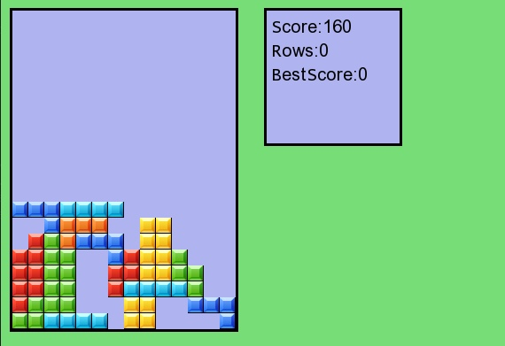

<h1 align="center">
Tetris
</h1>

  </img>

*Установка:*
------------
mkdir build && cd build && cmake .. && make

*Запуск:*
---------
cd bin
./game

*Управление:*
-------------
+ Up - поворот.
+ Down - опустить вниз.
+ Left - сдвиг влево.
+ Right - сдвиг вправо.
+ Enter - фигура падает до упора.
+ Space - пауза.
